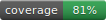
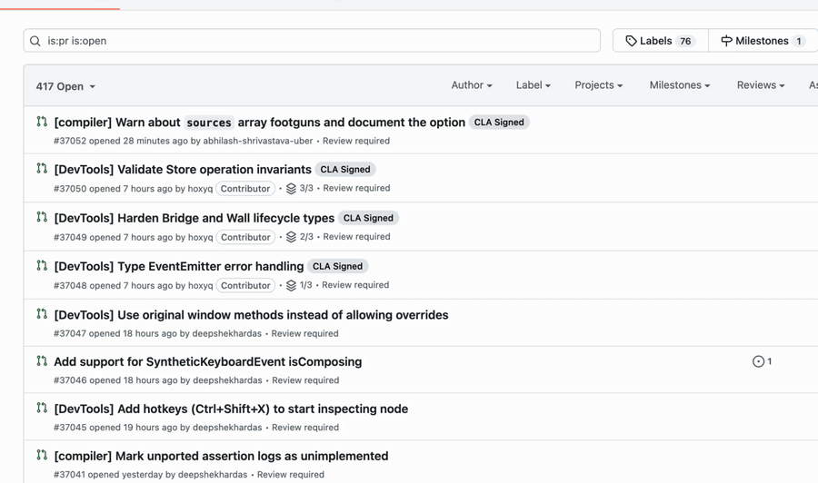

# GitHub PR Lifecycle Filter

[](https://github.com/tstejl/github-pr-filter/actions/workflows/ci.yml)

[](https://github.com/tstejl/github-pr-filter/releases/latest)

**A faster, more elegant way to find the pull requests that matter.**

GitHub PR Lifecycle Filter adds a focused lifecycle menu directly to repository pull-request
lists. Move between the work that needs attention, drafts that are not ready yet, and completed
work without rebuilding the same searches every day.



## Find the right pull requests faster

- Jump between **Needs review**, **Ready**, **Draft**, **Merged**, and other useful lifecycle
  views from one compact menu.
- Keep **Merged** work separate from pull requests that were **Closed without merging**.
- See the number of matching pull requests before opening the menu.
- Combine lifecycle views with GitHub's author, label, milestone, assignee, and review filters.
- Share or bookmark the resulting page normally—the selected lifecycle remains visible in the
  GitHub search query and URL.

The menu is designed to feel native to GitHub. It follows the active GitHub theme, uses Primer
icons and colors, and updates through GitHub's normal in-page navigation.

## Make each repository fit its workflow

Different repositories need different views. Open the menu's customization mode to:

- hide lifecycle choices that are not useful for that repository;
- drag choices into the order you use them;
- add, remove, and rearrange separators to create meaningful groups; and
- restore that repository's default layout at any time.

Preferences are saved independently for each repository. A layout customized for one project
will not change any other project.

If you follow a link whose query matches a hidden lifecycle, the extension still shows that
active choice temporarily so the page always explains what you are viewing. Your saved layout
is left unchanged.

## Your configuration stays local

Repository layouts are stored with the browser extension on your device. They are available in
normal and private windows when the extension is allowed to run privately, but they are not
uploaded to GitHub or synchronized by this extension.

The extension:

- does not call the GitHub API;
- does not require a GitHub token;
- does not use analytics or a backend;
- does not collect or transmit browsing activity; and
- automatically discards an unreadable saved layout and safely returns that repository to the
  defaults.

Only the browser's `storage` permission is requested. Content scripts are limited to
`https://github.com/*` and activate only on supported repository pull-request lists.

See [PRIVACY.md](PRIVACY.md) for the complete privacy policy.

## Installation

Signed Chrome Web Store and Firefox Add-ons builds are the recommended installation route.
Store links will be added here when their listings complete review.

For testing or manual installation, each [GitHub release](https://github.com/tstejl/github-pr-filter/releases/latest)
contains separate unsigned packages for Chromium and Firefox, plus SHA-256 checksums.

- **Chromium:** download and extract the Chromium ZIP. Open
  `chrome://extensions`, enable developer mode, choose **Load unpacked**, and select the
  extracted folder.
- **Firefox:** extract the Firefox ZIP, open `about:debugging#/runtime/this-firefox`, choose
  **Load Temporary Add-on**, and select its `manifest.json`. Firefox removes temporary add-ons
  after restart; use the signed Firefox Add-ons build for permanent installation.

## Supported browsers and pages

The extension supports current desktop Chromium browsers and Firefox 140 or newer on
`github.com`. It intentionally targets repository pull-request lists such as
`github.com/owner/repository/pulls`; GitHub's separate global pull-request page is not modified.

Firefox for Android and custom GitHub domains are not currently supported.

<details>
<summary><strong>Development and testing</strong></summary>

The packaged extension has no runtime dependencies. Bun 1.3.11 compiles the TypeScript source
into readable, non-minified browser bundles for Chromium and Firefox.

```sh
bun install --frozen-lockfile
bun run check
bun run test:coverage
bun run coverage:check
bun run test:e2e:chromium
bun run test:e2e:firefox
bun run storybook
bun run test:visual
```

Tests run against controlled local fixtures rather than live GitHub data. The suite includes
unit and storage tests, packaged-extension E2E coverage in Chromium and Firefox, and Storybook
visual contracts across light, dark, and high-contrast themes.

Use `bun run coverage:update` after an intentional coverage change. CI verifies that the
checked-in coverage badge matches the generated LCOV report.

To build or package the extension manually:

```sh
bun run build
bun run lint:firefox
bun run build:firefox
bun run release:package
```

See [CONTRIBUTING.md](CONTRIBUTING.md) for the complete local validation workflow.

</details>

## Contributing

Bug reports and focused pull requests are welcome. Please open an
[issue](https://github.com/tstejl/github-pr-filter/issues) when GitHub changes its pull-request
layout or query behavior.

## License

[MIT](LICENSE)
